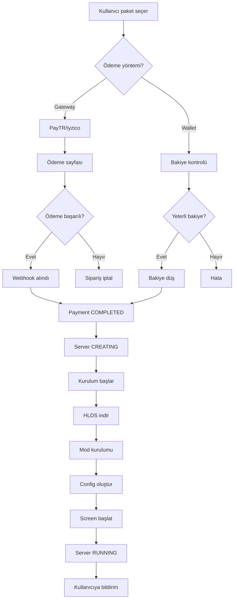
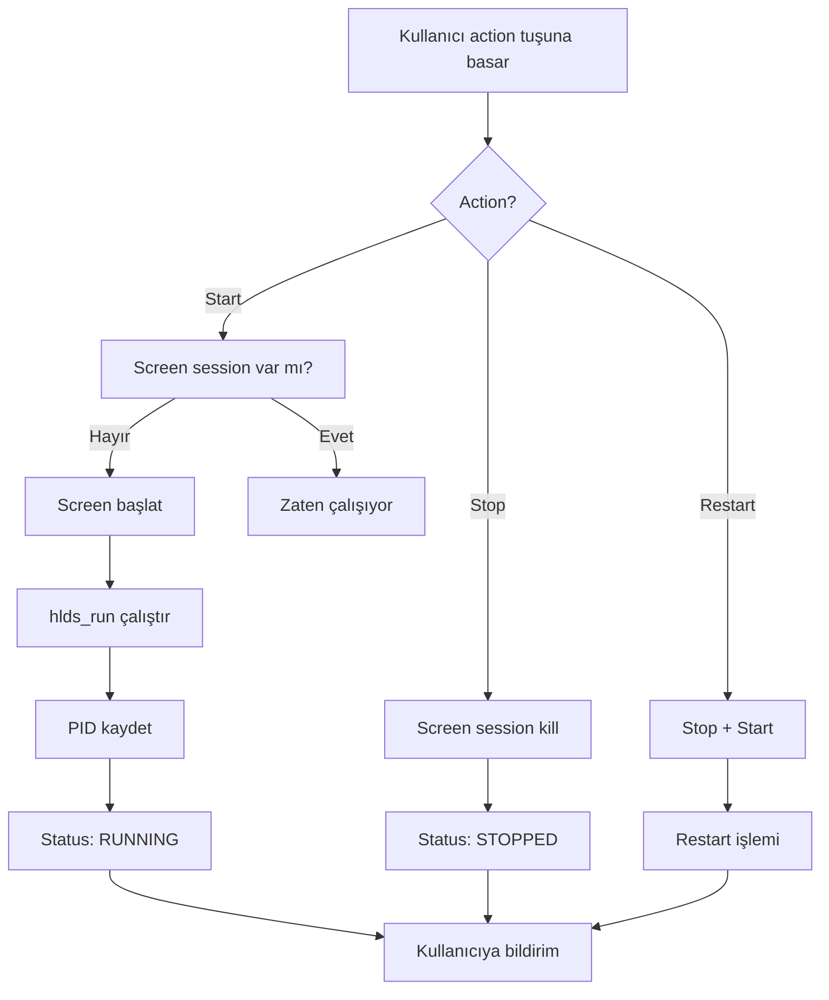
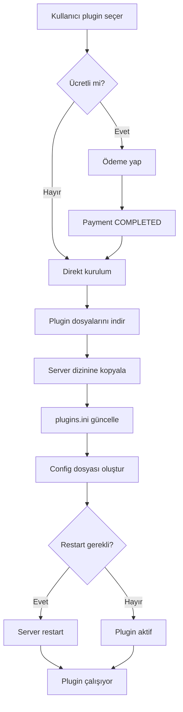

# AGTR Merkezi - Server Kiralama Sistemi Dokümantasyonu
**Tarih:** 2026-01-24
**Versiyon:** v6.0
**Durum:** Production Ready

---

## 📋 İçindekiler

1. [Sistem Genel Bakış](#sistem-genel-bakış)
2. [Veritabanı Mimarisi](#veritabanı-mimarisi)
3. [Backend API Endpoints](#backend-api-endpoints)
4. [Ödeme Sistemi](#ödeme-sistemi)
5. [Sunucu Kurulum Süreci](#sunucu-kurulum-süreci)
6. [Sunucu Yönetim Paneli](#sunucu-yönetim-paneli)
7. [Frontend Bileşenleri](#frontend-bileşenleri)
8. [İş Akışı Diyagramları](#iş-akışı-diyagramları)
9. [Güvenlik ve RBAC](#güvenlik-ve-rbac)
10. [Otomasyonlar](#otomasyonlar)

---

## 🎯 Sistem Genel Bakış

AGTR Merkezi, Half-Life 1 (HLDM, Adrenaline Gamer, CS 1.6) sunucularının otomatik kiralama ve yönetim platformudur.

### Temel Özellikler

- ✅ **Otomatik Sunucu Kurulumu**: Ödeme onayından sonra 30 saniye içinde kurulum
- ✅ **Çoklu Ödeme Yöntemi**: PayTR, iyzico, TL Bakiye, Armor Coin
- ✅ **RCON Yönetimi**: Web üzerinden sunucu kontrolü
- ✅ **Plugin Marketi**: 1-tık plugin kurulumu
- ✅ **Backup Sistemi**: Otomatik ve manuel yedekleme
- ✅ **Resource Monitoring**: CPU, RAM, Disk, Network takibi
- ✅ **Scheduled Tasks**: Zamanlanmış görevler (restart, backup, vb.)
- ✅ **Live Console**: Real-time sunucu konsolu
- ✅ **Config Editor**: Sunucu ayarlarını düzenleme
- ✅ **Auto-Renew**: Otomatik yenileme sistemi
- ✅ **Multi-Tenant**: Her kullanıcı sadece kendi sunucularını görür

### Desteklenen Oyun Türleri

```python
class GameType(enum.Enum):
    HLDM = "hldm"      # Half-Life Deathmatch
    AG = "ag"          # Adrenaline Gamer
    CS16 = "cs16"      # Counter-Strike 1.6
```

---

## 🗄️ Veritabanı Mimarisi

### 1. ServerPackage (Sunucu Paketleri)

Hazır sunucu paketleri (12 slot, 16 slot, 24 slot, vb.)

```sql
CREATE TABLE server_packages (
    id INT PRIMARY KEY AUTO_INCREMENT,
    slug VARCHAR(50) UNIQUE,           -- 'ag-12-slot', 'hldm-16-slot'
    name VARCHAR(100),                 -- 'AG 12 Slot'
    game_type ENUM('hldm','ag','cs16'),
    slots INT,                         -- 12, 16, 24, 32
    features JSON,                     -- ['rcon', 'ftp', 'mysql', ...]
    description TEXT,
    price_monthly FLOAT,               -- Aylık fiyat (TL)
    is_active BOOLEAN DEFAULT TRUE,
    is_popular BOOLEAN DEFAULT FALSE,
    display_order INT DEFAULT 0,
    created_at DATETIME,
    updated_at DATETIME
);
```

**Örnek Features:**
```json
{
  "rcon": true,
  "ftp": true,
  "mysql": false,
  "plugins": true,
  "custom_maps": true,
  "ddos_protection": true,
  "priority_support": false
}
```

### 2. GameServer (Kullanıcı Sunucuları)

Kiralanan sunucular

```sql
CREATE TABLE game_servers (
    id INT PRIMARY KEY AUTO_INCREMENT,
    owner_id INT,                      -- User ID
    owner_steam_id VARCHAR(50),        -- STEAM_0:0:123456 (hızlı arama)
    name VARCHAR(100),                 -- 'Benim HLDM Sunucum'
    game_type ENUM('hldm','ag','cs16'),
    ip_address VARCHAR(45),            -- '185.171.25.138'
    port INT,                          -- 27015
    slots INT,                         -- 16

    -- Şifreler
    rcon_password VARCHAR(50),         -- Otomatik üretilir
    sv_password VARCHAR(50),           -- Opsiyonel

    -- Paket bilgileri
    package_id INT,                    -- ServerPackage ID
    is_custom_package BOOLEAN,         -- Özel paket mi?
    features JSON,                     -- Paket özellikleri

    -- DNS ve alan adı
    custom_domain VARCHAR(100),        -- agtr.oyun.com (opsiyonel)

    -- Durum
    status ENUM('pending','creating','running','stopped','suspended','expired','deleted','cancelled'),
    current_map VARCHAR(64),           -- 'crossfire'
    current_players INT DEFAULT 0,     -- 5/16

    -- Süre ve yenileme
    expires_at DATETIME,               -- Son kullanma tarihi
    auto_renew BOOLEAN DEFAULT FALSE,  -- Otomatik yenileme

    -- Teknik bilgiler
    auto_restart BOOLEAN DEFAULT TRUE, -- Crash sonrası otomatik restart
    crash_count INT DEFAULT 0,
    last_crash DATETIME,

    -- Fiyatlandırma
    monthly_price FLOAT,               -- Aylık fiyat

    -- Panel v6.0 özellikleri
    unique_code VARCHAR(20) UNIQUE,    -- 'AGTR-2026-00001'
    mod_type VARCHAR(50),              -- 'ag', 'ag_openag', 'cstrike'
    server_path VARCHAR(500),          -- '/home/gameservers/servers/server_1'
    screen_name VARCHAR(50),           -- 'agtr_server_1'
    process_pid INT,                   -- 12345 (running process)
    last_heartbeat DATETIME,           -- Son monitoring check
    installation_id INT,               -- Installation record

    created_at DATETIME,
    updated_at DATETIME,
    last_started DATETIME
);
```

**Server Status Flow:**
```
PENDING → CREATING → RUNNING
              ↓
         STOPPED ⟷ SUSPENDED
              ↓
         EXPIRED → DELETED
              ↓
         CANCELLED
```

### 3. Payment (Ödemeler)

```sql
CREATE TABLE payments (
    id INT PRIMARY KEY AUTO_INCREMENT,
    user_id INT,
    server_id INT,                     -- İlişkili sunucu
    amount FLOAT,                      -- Ödeme tutarı (TL)
    status ENUM('pending','completed','failed','refunded','cancelled'),
    method ENUM('iyzico','paytr','bank_transfer','balance'),
    reference_code VARCHAR(50) UNIQUE, -- 'SRV-2026-12345'
    description TEXT,                  -- 'AG 16 Slot - 3 Aylık'

    -- İndirim ve kupon
    discount_amount FLOAT DEFAULT 0,
    coupon_code VARCHAR(50),

    -- Süre bilgisi
    months INT,                        -- Kaç aylık ödeme

    -- Gateway bilgileri
    gateway_transaction_id VARCHAR(255),
    gateway_response JSON,

    -- IP ve güvenlik
    ip_address VARCHAR(45),
    user_agent VARCHAR(500),

    created_at DATETIME,
    completed_at DATETIME,
    expires_at DATETIME
);
```

**Payment Status Flow:**
```
PENDING → COMPLETED → [Server activates]
    ↓
  FAILED → [Retry or cancel]
    ↓
CANCELLED

COMPLETED → REFUNDED → [Server suspended]
```

### 4. WalletTransaction (Bakiye İşlemleri)

```sql
CREATE TABLE wallet_transactions (
    id INT PRIMARY KEY AUTO_INCREMENT,
    user_id INT,
    amount FLOAT,                      -- Miktar
    wallet_type ENUM('real','coin'),   -- TL veya Armor
    transaction_type ENUM('deposit','withdraw','payment','refund','bonus','transfer'),
    description TEXT,
    reference_id VARCHAR(100),         -- Payment ID veya diğer referans
    reference_type VARCHAR(50),        -- 'payment', 'bonus', vb.
    balance_before FLOAT,              -- İşlem öncesi bakiye
    balance_after FLOAT,               -- İşlem sonrası bakiye

    -- Metadata
    ip_address VARCHAR(45),
    user_agent VARCHAR(500),
    extra_data JSON,

    created_at DATETIME
);
```

**Wallet Types:**
- `real`: TL bakiye (gerçek para, PayTR/iyzico ile yüklenebilir)
- `coin`: Armor coin (sanal para, oyunlarda kazanılır veya hediye edilir)

**Conversion Rate:**
```
1 TL = 100 Armor
```

### 5. ServerAction (Sunucu İşlem Logları)

```sql
CREATE TABLE server_actions (
    id INT PRIMARY KEY AUTO_INCREMENT,
    server_id INT,
    user_id INT,                       -- İşlemi yapan kullanıcı
    action VARCHAR(50),                -- 'start', 'stop', 'restart', 'delete'
    status ENUM('pending','success','failed'),
    output TEXT,                       -- Komut çıktısı
    error_message TEXT,                -- Hata mesajı
    duration_ms INT,                   -- İşlem süresi (ms)
    ip_address VARCHAR(45),
    created_at DATETIME
);
```

### 6. RconLog (RCON Komut Logları)

```sql
CREATE TABLE rcon_logs (
    id INT PRIMARY KEY AUTO_INCREMENT,
    server_id INT,
    user_id INT,
    command TEXT,                      -- 'changelevel crossfire'
    response TEXT,                     -- Sunucu yanıtı
    success BOOLEAN,
    ip_address VARCHAR(45),
    created_at DATETIME
);
```

### 7. ServerPlugin (Sunucu Pluginleri)

```sql
CREATE TABLE server_plugins (
    id INT PRIMARY KEY AUTO_INCREMENT,
    server_id INT,
    plugin_id INT,                     -- Plugin marketplace ID
    version VARCHAR(20),
    is_enabled BOOLEAN DEFAULT TRUE,
    config JSON,                       -- Plugin ayarları
    installed_at DATETIME,
    updated_at DATETIME
);
```

### 8. ServerBackup (Yedeklemeler)

```sql
CREATE TABLE server_backups (
    id INT PRIMARY KEY AUTO_INCREMENT,
    server_id INT,
    filename VARCHAR(255),             -- 'backup_2026-01-24_143022.tar.gz'
    file_path VARCHAR(500),            -- '/var/www/backups/servers/1/...'
    file_size BIGINT,                  -- Bytes
    backup_type ENUM('manual','auto','pre_update'),
    status ENUM('pending','completed','failed'),
    notes TEXT,
    created_by INT,
    created_at DATETIME
);
```

### 9. ScheduledTask (Zamanlanmış Görevler)

```sql
CREATE TABLE scheduled_tasks (
    id INT PRIMARY KEY AUTO_INCREMENT,
    server_id INT,
    task_type VARCHAR(50),             -- 'restart', 'backup', 'rcon_command'
    task_name VARCHAR(100),            -- 'Günlük restart'
    schedule_type ENUM('once','daily','weekly','monthly'),
    schedule_time TIME,                -- '03:00:00'
    schedule_day INT,                  -- Hafta/ay günü
    command TEXT,                      -- Çalıştırılacak komut
    is_active BOOLEAN DEFAULT TRUE,
    last_run DATETIME,
    next_run DATETIME,
    created_by INT,
    created_at DATETIME
);
```

---

## 🌐 Backend API Endpoints

### Server Package Endpoints

#### 1. List Packages
```http
GET /api/servers/packages
```

**Response:**
```json
{
  "packages": [
    {
      "id": 1,
      "slug": "ag-12-slot",
      "name": "AG 12 Slot",
      "game_type": "ag",
      "slots": 12,
      "price_monthly": 49.99,
      "features": {
        "rcon": true,
        "ftp": true,
        "plugins": true
      },
      "is_popular": false
    }
  ]
}
```

### Server Order Endpoints

#### 2. Order Package (Gateway Payment)
```http
POST /api/servers/order/package
Authorization: Bearer <token>
```

**Request:**
```json
{
  "package_id": 1,
  "months": 3,
  "server_name": "Benim AG Sunucum",
  "auto_renew": false
}
```

**Response:**
```json
{
  "success": true,
  "order": {
    "server_id": 42,
    "payment_id": 123,
    "reference_code": "SRV-2026-12345",
    "amount": 134.97,
    "server_info": {
      "name": "Benim AG Sunucum",
      "ip": "185.171.25.138:27015",
      "slots": 12
    }
  }
}
```

**İş Akışı:**
1. Package seçilir
2. Müsait IP:PORT slot bulunur
3. İndirim hesaplanır (3+ ay, 6+ ay, 12+ ay)
4. Sunucu `PENDING` durumunda oluşturulur
5. Payment kaydı `PENDING` durumunda oluşturulur
6. Kullanıcı ödeme gateway'ine yönlendirilir
7. Ödeme tamamlanınca webhook gelir
8. Sunucu kurulumu başlatılır

#### 3. Order with Wallet Balance
```http
POST /api/servers/order/package-wallet
Authorization: Bearer <token>
```

**Request:**
```json
{
  "package_id": 1,
  "months": 1,
  "server_name": "Test Sunucum",
  "auto_renew": false,
  "payment_type": "tl"  // "tl" veya "armor"
}
```

**Response:**
```json
{
  "success": true,
  "server": {
    "id": 43,
    "name": "Test Sunucum",
    "ip": "185.171.25.138:27016",
    "status": "creating",
    "expires_at": "2026-02-24T12:00:00"
  },
  "transaction": {
    "id": 789,
    "amount": 49.99,
    "wallet_type": "real",
    "balance_after": 150.01
  }
}
```

**İş Akışı:**
1. Bakiye kontrolü yapılır
2. Bakiye düşürülür (WalletTransaction)
3. Sunucu hemen `CREATING` durumuna alınır
4. Sunucu kurulumu başlatılır
5. Payment `COMPLETED` olarak kaydedilir

### Server Management Endpoints

#### 4. List My Servers
```http
GET /api/servers/my
Authorization: Bearer <token>
```

**Response:**
```json
{
  "servers": [
    {
      "id": 42,
      "unique_code": "AGTR-2026-00042",
      "name": "Benim AG Sunucum",
      "game_type": "ag",
      "ip_address": "185.171.25.138",
      "port": 27015,
      "slots": 12,
      "status": "running",
      "current_players": 5,
      "current_map": "crossfire",
      "expires_at": "2026-04-24T12:00:00",
      "auto_renew": false,
      "monthly_price": 49.99
    }
  ],
  "total": 1
}
```

#### 5. Get Server Detail
```http
GET /api/servers/{id}
Authorization: Bearer <token>
```

**Response:**
```json
{
  "server": {
    "id": 42,
    "name": "Benim AG Sunucum",
    "game_type": "ag",
    "ip_address": "185.171.25.138",
    "port": 27015,
    "slots": 12,
    "rcon_password": "abc123xyz",
    "status": "running",
    "current_map": "crossfire",
    "current_players": 5,
    "max_players": 12,
    "hostname": "AG Pro Server #1",
    "expires_at": "2026-04-24T12:00:00",
    "auto_renew": false,
    "features": {
      "rcon": true,
      "ftp": true,
      "plugins": true
    },
    "server_info": {
      "version": "48",
      "protocol": 48,
      "map": "crossfire",
      "folder": "ag",
      "game": "Adrenaline Gamer",
      "ping": 15
    }
  }
}
```

#### 6. Server Actions (Start/Stop/Restart)
```http
POST /api/servers/{id}/action
Authorization: Bearer <token>
```

**Request:**
```json
{
  "action": "restart"  // "start", "stop", "restart"
}
```

**Response:**
```json
{
  "success": true,
  "message": "Sunucu yeniden başlatılıyor...",
  "action_id": 456
}
```

**İş Akışı:**
- `start`: Screen session'da `./hlds_run` başlatılır
- `stop`: `screen -S <name> -X quit` ile durdurulur
- `restart`: Stop + Start

#### 7. RCON Command
```http
POST /api/servers/{id}/rcon
Authorization: Bearer <token>
```

**Request:**
```json
{
  "command": "changelevel crossfire"
}
```

**Response:**
```json
{
  "success": true,
  "output": "Changing level to crossfire\n",
  "command": "changelevel crossfire"
}
```

**Supported RCON Commands:**
- `status` - Oyuncu listesi
- `changelevel <map>` - Harita değiştir
- `kick <name>` - Oyuncu at
- `ban <steamid>` - Ban
- `say <message>` - Mesaj yaz
- `restart` - Sunucu restart
- `exec <config.cfg>` - Config çalıştır

#### 8. Upload Config File
```http
POST /api/servers/{id}/upload-config
Authorization: Bearer <token>
Content-Type: multipart/form-data
```

**Request:**
```
file: server.cfg (text/plain)
```

**Response:**
```json
{
  "success": true,
  "message": "Config dosyası yüklendi: server.cfg",
  "path": "/home/gameservers/servers/server_42/ag/server.cfg"
}
```

#### 9. Edit Config
```http
PUT /api/servers/{id}/config
Authorization: Bearer <token>
```

**Request:**
```json
{
  "filename": "server.cfg",
  "content": "hostname \"My AG Server\"\nrcon_password \"abc123\"\nsv_password \"\"\n..."
}
```

**Response:**
```json
{
  "success": true,
  "message": "Config dosyası güncellendi",
  "backup_created": true
}
```

**Korunan Ayarlar (Değiştirilemez):**
- `sv_lan` - Her zaman 0
- `ip` - Sunucu IP
- `port` - Sunucu port
- `rcon_password` - Panel kontrolü
- `sys_ticrate`, `fps_max` - Performans ayarları

#### 10. Create Backup
```http
POST /api/servers/{id}/backup
Authorization: Bearer <token>
```

**Request:**
```json
{
  "notes": "Güncelleme öncesi yedek"
}
```

**Response:**
```json
{
  "success": true,
  "backup": {
    "id": 789,
    "filename": "backup_2026-01-24_143022.tar.gz",
    "file_size": 524288000,
    "created_at": "2026-01-24T14:30:22"
  }
}
```

**Backup İçeriği:**
- `ag/` klasörü (maps, configs, logs)
- `addons/` klasörü (plugins)
- `database/` (varsa)

#### 11. Restore Backup
```http
POST /api/servers/{id}/backup/{backup_id}/restore
Authorization: Bearer <token>
```

**Response:**
```json
{
  "success": true,
  "message": "Yedek geri yükleniyor... Sunucu restart edilecek."
}
```

### Plugin Endpoints

#### 12. List Available Plugins
```http
GET /api/plugins
```

**Response:**
```json
{
  "plugins": [
    {
      "id": 1,
      "slug": "amxmodx",
      "name": "AMX Mod X",
      "version": "1.10.0",
      "description": "Base plugin system",
      "category": "core",
      "price": 0,
      "is_free": true,
      "compatible_games": ["ag", "hldm", "cs16"]
    },
    {
      "id": 2,
      "slug": "admin-menu",
      "name": "Admin Menu",
      "version": "1.0",
      "category": "admin",
      "price": 0,
      "is_free": true
    }
  ]
}
```

#### 13. Install Plugin
```http
POST /api/servers/{id}/plugins/install
Authorization: Bearer <token>
```

**Request:**
```json
{
  "plugin_id": 2
}
```

**Response:**
```json
{
  "success": true,
  "message": "Plugin kuruldu: Admin Menu",
  "restart_required": true
}
```

**İş Akışı:**
1. Plugin dosyaları `/home/gameservers/servers/server_X/addons/` altına kopyalanır
2. Config dosyaları oluşturulur
3. `plugins.ini` güncellenir
4. ServerPlugin kaydı oluşturulur
5. Sunucu restart gerekiyorsa bildirim

#### 14. Uninstall Plugin
```http
DELETE /api/servers/{id}/plugins/{plugin_id}
Authorization: Bearer <token>
```

**Response:**
```json
{
  "success": true,
  "message": "Plugin kaldırıldı"
}
```

### Resource Monitoring Endpoints

#### 15. Get Server Stats
```http
GET /api/servers/{id}/stats
Authorization: Bearer <token>
```

**Response:**
```json
{
  "current": {
    "cpu_percent": 15.3,
    "memory_mb": 256.5,
    "memory_percent": 12.8,
    "disk_mb": 1024.0,
    "disk_percent": 5.2,
    "player_count": 5,
    "uptime_seconds": 3600
  },
  "history": [
    {
      "recorded_at": "2026-01-24T14:25:00",
      "cpu_percent": 14.2,
      "memory_mb": 250.3,
      "player_count": 4
    }
  ]
}
```

### Scheduled Task Endpoints

#### 16. Create Scheduled Task
```http
POST /api/servers/{id}/tasks
Authorization: Bearer <token>
```

**Request:**
```json
{
  "task_name": "Günlük restart",
  "task_type": "restart",
  "schedule_type": "daily",
  "schedule_time": "03:00:00"
}
```

**Response:**
```json
{
  "success": true,
  "task": {
    "id": 123,
    "task_name": "Günlük restart",
    "next_run": "2026-01-25T03:00:00"
  }
}
```

**Task Types:**
- `restart` - Sunucu restart
- `backup` - Yedekleme
- `rcon_command` - RCON komutu çalıştır
- `map_rotation` - Harita rotasyonu

---

## 💳 Ödeme Sistemi

### Ödeme Yöntemleri

#### 1. PayTR (Kredi Kartı)
- Türk kullanıcılar için
- %2.9 komisyon
- Anında onay
- 3D Secure zorunlu

#### 2. iyzico (Kredi Kartı/Debit Kart)
- Uluslararası kart desteği
- %3.5 komisyon
- Taksit seçenekleri

#### 3. TL Bakiye (Wallet)
- Önceden yüklenmiş bakiye
- %0 komisyon
- Anında aktivasyon

#### 4. Armor Coin (Virtual Currency)
- Oyun içi kazanılan coin
- %0 komisyon
- 1 TL = 100 Armor

### İndirim Oranları

```python
DISCOUNT_3_MONTH = 0.05   # %5 indirim
DISCOUNT_6_MONTH = 0.10   # %10 indirim
DISCOUNT_12_MONTH = 0.20  # %20 indirim
```

**Örnek Hesaplama:**
```
Paket: AG 12 Slot - 49.99 TL/ay
Süre: 6 ay
İndirim: %10

Toplam = 49.99 * 6 * (1 - 0.10)
       = 49.99 * 6 * 0.90
       = 269.95 TL
```

### Payment Gateway Flow

#### PayTR Integration

```python
# 1. Order oluştur
POST /api/servers/order/package
→ server_id, payment_id, reference_code

# 2. PayTR checkout sayfası oluştur
POST /api/payment/paytr/checkout
→ paytr_url (iframe URL)

# 3. Kullanıcı ödeme yapar

# 4. PayTR webhook gelir
POST /api/payment/paytr/webhook
→ Payment status: COMPLETED
→ Server status: CREATING
→ Installation başlar
```

#### Wallet Balance Flow

```python
# 1. Bakiye kontrolü
GET /api/wallet/balance
→ balance_real: 500.00 TL
→ balance_coin: 10000 Armor

# 2. Direkt satın al
POST /api/servers/order/package-wallet
{
  "payment_type": "tl",  # veya "armor"
  "package_id": 1,
  "months": 1
}
→ Bakiye düşer
→ Server hemen kurulur (CREATING)
→ Payment COMPLETED
```

### Kupon Sistemi

```sql
-- Kupon oluştur
INSERT INTO coupons (code, discount_type, discount_value, max_uses)
VALUES ('YILBASI2026', 'percent', 25.0, 100);

-- Kupon kullan
POST /api/payment/apply-coupon
{
  "code": "YILBASI2026",
  "order_amount": 149.97
}
→ discount_amount: 37.49 TL
→ final_amount: 112.48 TL
```

**Kupon Türleri:**
- `percent`: Yüzde indirim (%25)
- `fixed`: Sabit indirim (50 TL)

---

## 🔧 Sunucu Kurulum Süreci

### Installation Flow

```
PAYMENT COMPLETED
    ↓
Server Status: PENDING → CREATING
    ↓
1. IP:PORT slot tahsis edildi mi? ✓
    ↓
2. Server dizini oluştur
   /home/gameservers/servers/server_X/
    ↓
3. HLDS kurulumu
   - SteamCMD ile Half-Life indir
   - Mod kurulumu (ag/cstrike/valve)
    ↓
4. Config dosyaları oluştur
   - server.cfg
   - mapcycle.txt
   - motd.txt
    ↓
5. AMX Mod X kurulumu (opsiyonel)
   - Base plugins
   - Admin listesi
    ↓
6. Screen session başlat
   screen -dmS agtr_server_X ./hlds_run ...
    ↓
7. Process PID kaydet
    ↓
8. Status: CREATING → RUNNING
    ↓
✅ Sunucu aktif!
```

### Kurulum Komutları

```bash
# 1. Dizin oluştur
mkdir -p /home/gameservers/servers/server_42

# 2. SteamCMD ile Half-Life indir
/usr/games/steamcmd +login anonymous +force_install_dir /home/gameservers/servers/server_42 +app_update 90 validate +quit

# 3. Mod kurulumu (AG)
cd /home/gameservers/servers/server_42
wget https://github.com/rtxa/agmod/releases/download/7.5/ag_linux.tar.gz
tar -xzf ag_linux.tar.gz

# 4. AMX Mod X kurulumu
wget https://www.amxmodx.org/release/amxmodx-1.10.0-linux.tar.gz
tar -xzf amxmodx-1.10.0-linux.tar.gz -C ag/

# 5. Config oluştur
cat > ag/server.cfg << EOF
hostname "AGTR Server #42"
rcon_password "abc123xyz"
sv_password ""
mp_timelimit 20
mp_fraglimit 50
EOF

# 6. Screen session başlat
screen -dmS agtr_server_42 ./hlds_run -game ag +ip 185.171.25.138 +port 27015 +maxplayers 12 +map crossfire
```

### Otomatik Restart Script

```bash
#!/bin/bash
# /home/gameservers/servers/server_42/start.sh

while true; do
    ./hlds_run -game ag +ip 185.171.25.138 +port 27015 +maxplayers 12 +map crossfire
    echo "Server crashed! Restarting in 5 seconds..."
    sleep 5
done
```

---

## 🎮 Sunucu Yönetim Paneli

### MyServers.vue (Frontend)

Kullanıcının sunucularını listeler ve yönetir.

**Özellikler:**
- ✅ Server listesi (cards/table view)
- ✅ Status indicators (running, stopped, expired)
- ✅ Quick actions (start, stop, restart)
- ✅ Real-time player count
- ✅ Expiry countdown
- ✅ Renew button
- ✅ Navigate to detail page

**Görünüm:**
```vue
<template>
  <div class="my-servers">
    <!-- Stats Cards -->
    <div class="stats">
      <div class="stat-card">
        <div>{{ servers.length }}</div>
        <div>Toplam Sunucu</div>
      </div>
      <div class="stat-card">
        <div>{{ runningCount }}</div>
        <div>Çalışıyor</div>
      </div>
      <div class="stat-card">
        <div>{{ totalPlayers }}</div>
        <div>Aktif Oyuncu</div>
      </div>
    </div>

    <!-- Server Cards -->
    <div class="server-grid">
      <div v-for="server in servers" :key="server.id" class="server-card">
        <!-- Header -->
        <div class="server-header">
          <h3>{{ server.name }}</h3>
          <span :class="'status-' + server.status">
            {{ server.status }}
          </span>
        </div>

        <!-- Info -->
        <div class="server-info">
          <div>IP: {{ server.ip_address }}:{{ server.port }}</div>
          <div>Oyuncu: {{ server.current_players }}/{{ server.slots }}</div>
          <div>Harita: {{ server.current_map }}</div>
        </div>

        <!-- Actions -->
        <div class="server-actions">
          <button @click="startServer(server.id)" v-if="server.status === 'stopped'">
            Başlat
          </button>
          <button @click="stopServer(server.id)" v-if="server.status === 'running'">
            Durdur
          </button>
          <button @click="restartServer(server.id)" v-if="server.status === 'running'">
            Yeniden Başlat
          </button>
          <button @click="viewDetails(server.id)">
            Detaylar
          </button>
        </div>

        <!-- Expiry -->
        <div class="server-expiry" v-if="server.expires_at">
          <div>{{ getExpiryText(server.expires_at) }}</div>
          <button v-if="isExpiringSoon(server)">Yenile</button>
        </div>
      </div>
    </div>
  </div>
</template>
```

### ServerDetail.vue (Detay Sayfası)

Sunucu yönetim paneli

**Tabs:**
1. **Genel Bakış**
   - Server bilgileri
   - Real-time stats (CPU, RAM)
   - Player listesi
   - Console output (son 50 satır)

2. **RCON Konsolu**
   - Komut çalıştırma
   - Komut geçmişi
   - Sık kullanılan komutlar

3. **Dosya Yöneticisi**
   - Config dosyaları (server.cfg, mapcycle.txt)
   - Inline editor
   - Syntax highlighting
   - Backup before edit

4. **Pluginler**
   - Kurulu pluginler
   - Plugin marketi
   - 1-tık kurulum
   - Enable/Disable

5. **Yedekleme**
   - Yedekleme listesi
   - Manuel yedek al
   - Geri yükle
   - İndirme

6. **Zamanlanmış Görevler**
   - Task listesi
   - Yeni task oluştur
   - Düzenle/Sil

7. **İstatistikler**
   - CPU/RAM grafiği (son 24 saat)
   - Oyuncu sayısı grafiği
   - Uptime
   - Network trafiği

8. **Ayarlar**
   - Auto-renew
   - Server name
   - RCON password change
   - Delete server

---

## 📊 İş Akışı Diyagramları

### 1. Sunucu Sipariş Akışı



### 2. Server Start/Stop Akışı



### 3. Plugin Kurulum Akışı



---

## 🔒 Güvenlik ve RBAC

### Kullanıcı Rolleri

```python
class UserRole(enum.Enum):
    USER = "user"           # Normal kullanıcı
    MODERATOR = "moderator" # Forum moderatör
    ADMIN = "admin"         # Sistem admin
    SUPERADMIN = "superadmin"  # Tam yetki
```

### Erişim Kontrolleri

#### Server Owner Check
```python
def verify_server_ownership(server_id: int, user: User, db: Session):
    """Sunucu sahibi kontrolü"""
    server = db.query(GameServer).filter(
        GameServer.id == server_id,
        GameServer.owner_id == user.id,
        GameServer.status != ServerStatus.DELETED
    ).first()

    if not server:
        raise HTTPException(403, "Bu sunucuya erişim yetkiniz yok")

    return server
```

#### API Endpoint Security

```python
@router.post("/servers/{server_id}/action")
async def server_action(
    server_id: int,
    action: ServerActionRequest,
    current_user: User = Depends(get_current_user_required),  # ✅ Login gerekli
    db: Session = Depends(get_db)
):
    # ✅ Ownership check
    server = verify_server_ownership(server_id, current_user, db)

    # ✅ Server status check
    if server.status == ServerStatus.SUSPENDED:
        raise HTTPException(403, "Sunucu askıya alınmış")

    # ✅ Action execution
    result = execute_server_action(server, action.action)

    # ✅ Audit log
    log_action(server_id, current_user.id, action.action)

    return result
```

### Protected Operations

**Admin Only:**
- Delete any server
- View all servers
- Suspend servers
- Change server owner

**Owner Only:**
- Start/Stop/Restart server
- RCON commands
- Edit configs
- Install plugins
- Create backups
- Delete own server

**Public:**
- View server list (Servers.vue)
- View server packages
- View plugin marketplace

---

## ⚙️ Otomasyonlar

### Background Tasks (APScheduler)

#### 1. Expiry Checker (Günlük)
```python
@scheduler.scheduled_job('cron', hour=3, minute=0)
def check_expired_servers():
    """Süresi dolan sunucuları durdur"""
    db = SessionLocal()

    expired_servers = db.query(GameServer).filter(
        GameServer.expires_at < datetime.now(),
        GameServer.status.in_([ServerStatus.RUNNING, ServerStatus.STOPPED])
    ).all()

    for server in expired_servers:
        # Stop server
        stop_server(server)

        # Update status
        server.status = ServerStatus.EXPIRED
        db.commit()

        # Notify user
        send_notification(server.owner_id, f"Sunucunuz sona erdi: {server.name}")

    db.close()
```

#### 2. Auto-Renew Processor (Günlük)
```python
@scheduler.scheduled_job('cron', hour=2, minute=0)
def process_auto_renewals():
    """7 gün içinde dolacak auto-renew sunucuları yenile"""
    db = SessionLocal()

    soon_expiring = db.query(GameServer).filter(
        GameServer.auto_renew == True,
        GameServer.expires_at < datetime.now() + timedelta(days=7),
        GameServer.status == ServerStatus.RUNNING
    ).all()

    for server in soon_expiring:
        owner = db.query(User).get(server.owner_id)

        # Bakiye kontrolü
        if owner.balance >= server.monthly_price:
            # Ödeme al
            payment = create_payment(
                user_id=owner.id,
                amount=server.monthly_price,
                server_id=server.id,
                description=f"Auto-renew: {server.name}"
            )

            # Bakiye düş
            owner.balance -= server.monthly_price
            payment.status = PaymentStatus.COMPLETED

            # Süre uzat
            server.expires_at += timedelta(days=30)
            db.commit()

            # Bildirim
            send_notification(owner.id, f"Sunucunuz yenilendi: {server.name}")
        else:
            # Yetersiz bakiye
            send_notification(owner.id, f"Auto-renew başarısız (yetersiz bakiye): {server.name}")

    db.close()
```

#### 3. Resource Monitor (5 Dakikada Bir)
```python
@scheduler.scheduled_job('interval', minutes=5)
def monitor_server_resources():
    """Server kaynak kullanımını kaydet"""
    db = SessionLocal()

    running_servers = db.query(GameServer).filter(
        GameServer.status == ServerStatus.RUNNING
    ).all()

    for server in running_servers:
        if not server.process_pid:
            continue

        try:
            process = psutil.Process(server.process_pid)

            # CPU ve Memory
            cpu = process.cpu_percent(interval=1)
            memory = process.memory_info().rss / 1024 / 1024  # MB

            # Network (sunucu port'undan)
            net_io = psutil.net_io_counters(pernic=True)

            # Player count (A2S query)
            info = a2s.info((server.ip_address, server.port))
            players = info.player_count

            # Kaydet
            log = ResourceLog(
                server_id=server.id,
                cpu_percent=cpu,
                memory_mb=memory,
                player_count=players
            )
            db.add(log)

            # Update server
            server.current_players = players
            server.current_map = info.map_name
            server.last_heartbeat = datetime.now()

        except psutil.NoSuchProcess:
            # Process öldü, sunucu crashed
            server.status = ServerStatus.STOPPED
            server.crash_count += 1
            server.last_crash = datetime.now()

            # Auto-restart aktifse başlat
            if server.auto_restart and server.crash_count < 5:
                restart_server(server)

        db.commit()

    db.close()
```

#### 4. Scheduled Tasks Executor (Her Dakika)
```python
@scheduler.scheduled_job('interval', minutes=1)
def execute_scheduled_tasks():
    """Zamanı gelen taskleri çalıştır"""
    db = SessionLocal()

    pending_tasks = db.query(ScheduledTask).filter(
        ScheduledTask.is_active == True,
        ScheduledTask.next_run <= datetime.now()
    ).all()

    for task in pending_tasks:
        try:
            # Task çalıştır
            if task.task_type == 'restart':
                restart_server_by_id(task.server_id)
            elif task.task_type == 'backup':
                create_backup(task.server_id)
            elif task.task_type == 'rcon_command':
                execute_rcon(task.server_id, task.command)

            # Log
            task.last_run = datetime.now()

            # Next run hesapla
            if task.schedule_type == 'daily':
                task.next_run = datetime.combine(
                    datetime.now().date() + timedelta(days=1),
                    task.schedule_time
                )
            elif task.schedule_type == 'weekly':
                task.next_run = datetime.now() + timedelta(days=7)

            db.commit()

        except Exception as e:
            logger.error(f"Task execution failed: {e}")

    db.close()
```

#### 5. Cleanup Old Logs (Haftalık)
```python
@scheduler.scheduled_job('cron', day_of_week='sun', hour=4)
def cleanup_old_logs():
    """30 günden eski logları sil"""
    db = SessionLocal()

    cutoff = datetime.now() - timedelta(days=30)

    # Resource logs
    db.query(ResourceLog).filter(
        ResourceLog.recorded_at < cutoff
    ).delete()

    # RCON logs
    db.query(RconLog).filter(
        RconLog.created_at < cutoff
    ).delete()

    # Server actions
    db.query(ServerAction).filter(
        ServerAction.created_at < cutoff
    ).delete()

    db.commit()
    db.close()
```

---

## 📦 Örnek Paketler

```sql
INSERT INTO server_packages (slug, name, game_type, slots, price_monthly, features, is_popular) VALUES
('ag-12-slot', 'AG 12 Slot', 'ag', 12, 49.99, '{"rcon":true,"ftp":true,"plugins":true}', FALSE),
('ag-16-slot', 'AG 16 Slot', 'ag', 16, 69.99, '{"rcon":true,"ftp":true,"plugins":true,"priority_support":true}', TRUE),
('ag-24-slot', 'AG 24 Slot', 'ag', 24, 99.99, '{"rcon":true,"ftp":true,"plugins":true,"ddos_protection":true}', TRUE),
('hldm-12-slot', 'HLDM 12 Slot', 'hldm', 12, 39.99, '{"rcon":true,"ftp":true}', FALSE),
('cs16-16-slot', 'CS 1.6 16 Slot', 'cs16', 16, 79.99, '{"rcon":true,"ftp":true,"mysql":true}', FALSE);
```

---

## 🎯 Özet

AGTR Merkezi server kiralama sistemi, tam otomatik bir Half-Life sunucu hosting platformudur.

**Temel Akış:**
1. Kullanıcı paket seçer → 2. Ödeme yapar → 3. Sunucu otomatik kurulur → 4. 30 saniyede hazır

**Güçlü Yanlar:**
- ✅ Otomatik kurulum (SteamCMD + Screen)
- ✅ Web tabanlı RCON konsolu
- ✅ Plugin marketi (1-tık kurulum)
- ✅ Otomatik yedekleme ve geri yükleme
- ✅ Resource monitoring
- ✅ Auto-renew sistemi
- ✅ Multi-payment gateway
- ✅ Wallet system (TL + Armor)
- ✅ RBAC ve güvenlik
- ✅ Background tasks (APScheduler)

**Teknolojiler:**
- Backend: FastAPI (Python)
- Frontend: Vue.js 3
- Database: MySQL
- Server: Linux, Screen, SteamCMD
- Payment: PayTR, iyzico
- Query: python-a2s (Source query protocol)

---

**Last Updated:** 2026-01-24
**Documentation Status:** ✅ COMPLETE
